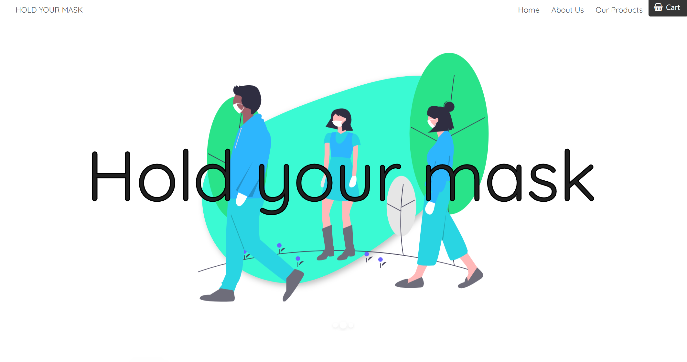

# Solo Project: Hold-your-mask
Made by [**Jean Fabry**](https://github.com/JeanFabry)

# What was asked ?
I was asked to create a prototype of an online shop for the young entrepreneurial project "Hold your mask". 

# What did I use ? 

* HTML5
* CSS3
* JavaScript
* Figma

# Preview
Feel free to have a look at the website [here](https://jeanfabry.github.io/Hold-your-mask/)

